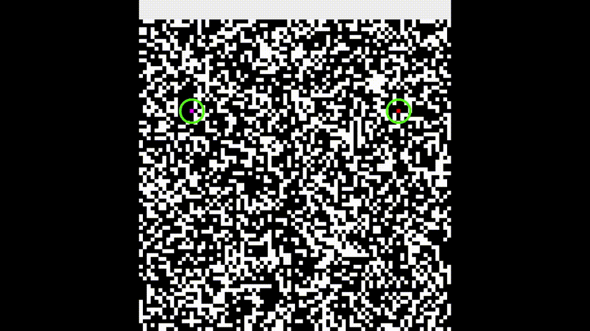
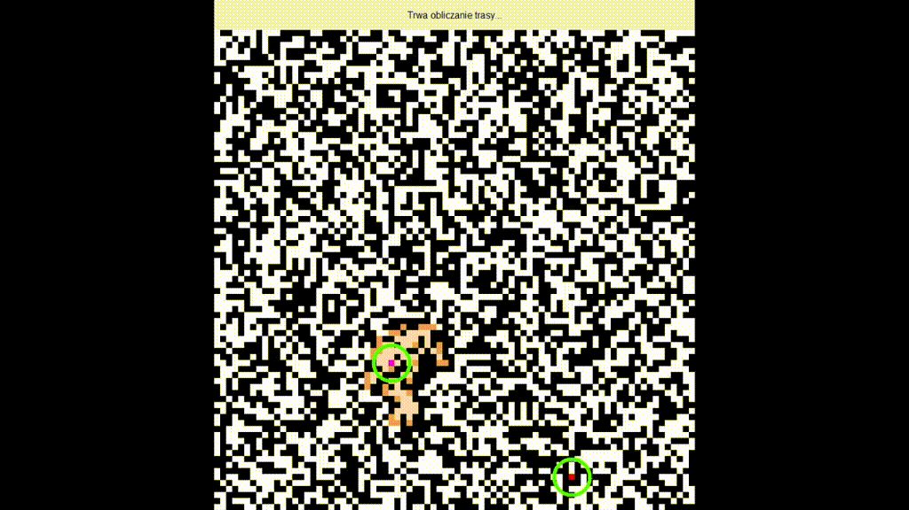
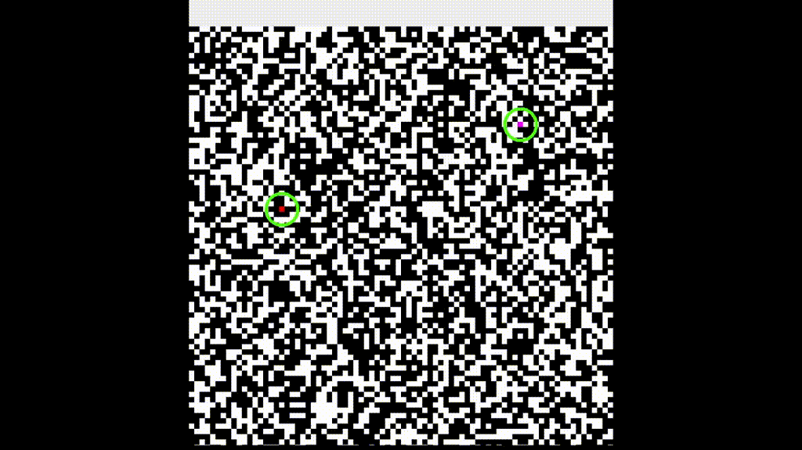

# Python A star algorithm

> Console program for calculating the shortest path between two points using A* algorithm and graphics.py to display.

## Table of contents

- [Python A star algorithm](#python-a-star-algorithm)
  - [Table of contents](#table-of-contents)
  - [General info](#general-info)
  - [Technologies](#technologies)
  - [Setup](#setup)
  - [Features](#features)
  - [Youtube video](#youtube-video)
  - [Screenshots and gifs](#screenshots-and-gifs)
  - [Status](#status)
  - [Why did I create it](#why-did-i-create-it)
  - [Contact](#contact)

## General info

Project made for university purpose. Both code and application language is Polish.
Application asks user for parameters to create board (size, blockade chance) then creates it, random two points and runs the algorithm.

## Technologies

* Python 3.10
* graphics.py

## Setup

TBD

## Features

* Easy to use
* Few options to configure

## Youtube video

TBD - now it's link to my account - 
[Check how it works!](https://www.youtube.com/channel/UCj8v_5Ox7-KI5v_2PtMgQSw)

## Screenshots and gifs

## Status

Project is _completed_.

That means it is finished, I like how it works and won't get any updates.

## Why did I create it

It was created for Programming in Python subject at university, and the A* algorithm sounded like the best choice for someone who likes video games.

## Contact

You can find contact information [here](https://jacek-jendrzejewski.azurewebsites.net/Contact).